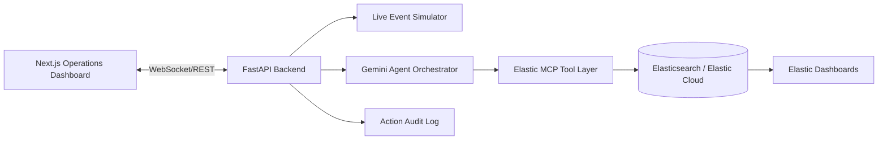

# WorldCupOps Agent

**AI Incident Commander for World Cup Operations**

WorldCupOps is a Gemini-powered operational response agent that uses an Elastic MCP integration to detect, investigate, plan, approve, execute, and monitor incident response for large-scale live events such as the FIFA World Cup.

> One-liner: WorldCupOps turns Gemini + Elastic MCP into a real-time command center agent for stadium operations.

## Why this wins

Most hackathon agents answer questions. WorldCupOps takes action under human oversight:

1. Detects a live operational anomaly.
2. Investigates root causes across multiple signals.
3. Retrieves similar historical incidents from Elastic.
4. Generates a structured mitigation plan with Gemini.
5. Requests operator approval.
6. Executes approved operational actions.
7. Monitors recovery metrics in real time.

## Demo storyline

A World Cup semifinal is underway. Normal operations are stable. Suddenly:

- Gate B crowd density spikes.
- Heavy rain slows gate processing.
- Stadium Express buses are delayed.
- Fan sentiment becomes negative.

The agent correlates the signals, queries Elastic through MCP tools, retrieves a similar past congestion incident, proposes actions, asks for approval, executes simulated workflows, and shows recovery.

## Architecture



## Core demo loop

```text
Normal telemetry -> Inject incident -> Agent detects anomaly -> Agent uses Elastic MCP -> Gemini plans response -> Operator approves -> Actions execute -> Metrics recover
```

## Tech stack

- Frontend: Next.js, React, TailwindCSS
- Backend: FastAPI, WebSockets, Pydantic
- Agent: Gemini / Google Cloud Agent Builder compatible orchestration layer
- Partner integration: Elastic MCP server
- Data: Elasticsearch indices for telemetry, incidents, history, and audit logs
- Deployment: Google Cloud Run for backend, Vercel for frontend, Elastic Cloud for search/observability

## Local quickstart

### 1. Backend

```bash
cd backend
python -m venv .venv
source .venv/bin/activate
pip install -r requirements.txt
uvicorn app.main:app --reload --port 8000
```

Open: `http://localhost:8000/docs`

### 2. Frontend

```bash
cd frontend
npm install
npm run dev
```

Open: `http://localhost:3000`

### 3. One-command local stack

```bash
docker compose up --build
```

## Environment variables

Copy `.env.example` to `.env`.

```bash
cp .env.example .env
```

Required for real integration:

- `GOOGLE_CLOUD_PROJECT`
- `GOOGLE_CLOUD_LOCATION`
- `GEMINI_MODEL`
- `ELASTICSEARCH_URL`
- `ELASTICSEARCH_API_KEY`
- `ELASTIC_MCP_SERVER_URL`

For hackathon demo mode, the app runs with simulated MCP/Gemini responses if keys are not provided.

## Elastic MCP integration

WorldCupOps uses Elastic as the operational intelligence layer. The agent calls MCP tools to:

- query current telemetry,
- retrieve similar historical incidents,
- inspect transport/weather/social logs,
- write incident summaries,
- store action audit trails,
- support observability dashboards.

See [`mcp/elastic_mcp_config.md`](mcp/elastic_mcp_config.md).

## Main API endpoints

| Endpoint | Method | Purpose |
|---|---:|---|
| `/health` | GET | Health check |
| `/api/state` | GET | Current operations state |
| `/api/simulator/inject/gate-b-surge` | POST | Inject winning demo incident |
| `/api/agent/analyze` | POST | Trigger agent investigation |
| `/api/incidents/{id}/approve` | POST | Approve recommended actions |
| `/api/incidents/{id}/rollback` | POST | Simulate rollback |
| `/ws/ops` | WS | Live telemetry and incident updates |

## Demo script

See [`docs/demo-script.md`](docs/demo-script.md).

## Submission checklist

- [ ] Hosted project URL
- [ ] Public GitHub repo
- [ ] Open source license visible in repo About section
- [ ] 3-minute demo video
- [ ] Elastic partner track selected
- [ ] README includes architecture, setup, demo, MCP explanation
- [ ] Dashboard shows Elastic MCP calls and AI reasoning
- [ ] Human approval is visible
- [ ] Recovery metrics are visible

## Roadmap

- Real Elastic MCP tool calls in production mode
- Google Cloud Agent Builder deployment
- Kibana dashboard embeds
- Multi-event simulation
- Predictive crowd surge forecasting
- multilingual public advisories
